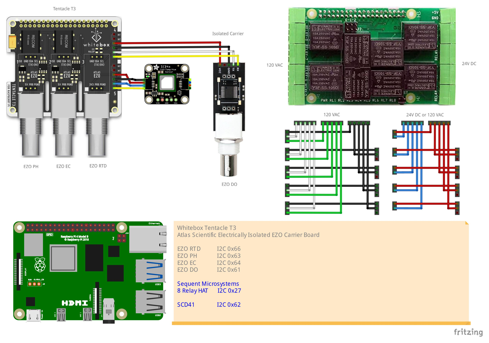
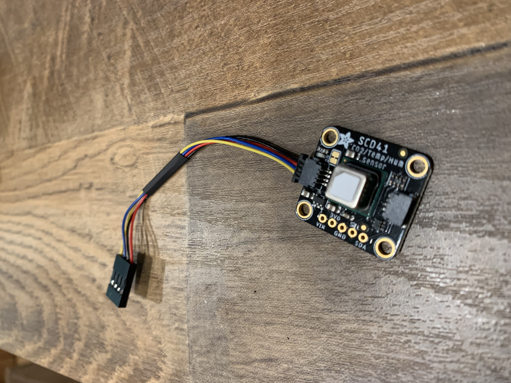
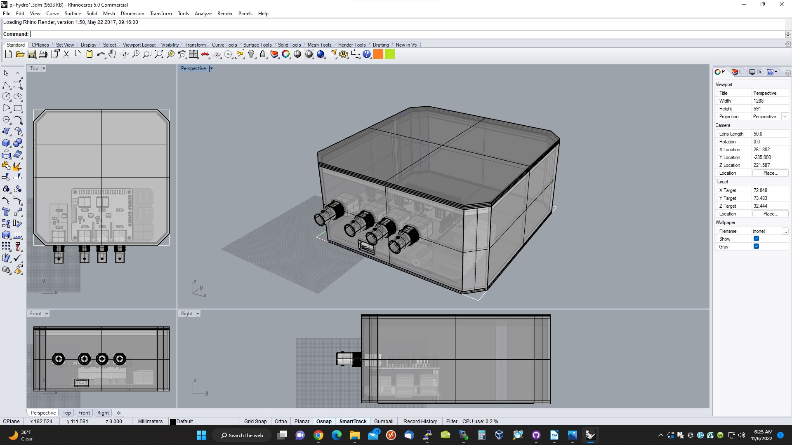

# Mycodo-hyrdoponic-build
A straightforward example of a hardware build to run Mycodo for hydroponics.

## Overview
A few years ago we moved and I finally had the space to start messing around with indoor hydroponics to grow fresh food in winter. At first I used the Kratky method because it was cheap, easy and simple. It worked very well but had it's limitations. As things grew they required more and more tending, sometimes I didn't have the time necessary to take care of them properly. This season I wanted to move on to a more advanced setup that could support fruiting crops such as tomatoes.

Part of my day job is designing and building industrial control and building automation systems. Mechanical timers and checking water quality with handheld devices absolutely works but seemed a little low-tech. What I wanted was something easy to assemble with common tools that I could monitor remotely. This is what I wanted to measure and control:

- Water Quality
  - Temperature
  - pH
  - EC (electrical conductivity)
  - DO (dissolved oxygen)
- Air Quality
  - Temperature
  - Humidity
  -CO2
- Control
  - Pump 1 - Ebb and Flow (120VAC)
  - Pump 2 - Recirculation (120VAC)
  - Grow Light 1 (120VAC)
  - Grow Light 2 (120VAC)
  - Spare 120VAC or 24VDC

## Hardware
All sensors are I2C bus.
- Raspberry Pi 3 or 4 (or equivalent)
  - [SanDisk 128GB Ultra microSDXC UHS-I Memory Card (or equivalent)](https://smile.amazon.com/gp/product/B08GYKNCCP/ref=ppx_yo_dt_b_asin_title_o04_s00?ie=UTF8&psc=1)
  - [2.5mm Nylon Standoffs (as needed)](https://smile.amazon.com/Generic-Spacer-Assorted-Raspberry-Pi-Standoff/dp/B014J1ZLD6/ref=sr_1_5?crid=3M7GM3E3F7HYO&keywords=2.5+mm+nylon+standoff&qid=1667400137&qu=eyJxc2MiOiIwLjAwIiwicXNhIjoiMC4wMCIsInFzcCI6IjAuMDAifQ%3D%3D&sprefix=2.5+mm+nylon+standoff%2Caps%2C80&sr=8-5)
  - [GeeekPi 2x20 40 Pin Stacking Female Header Kit (as needed)](https://smile.amazon.com/dp/B08GC18NMK?psc=1&ref=ppx_yo2ov_dt_b_product_details)
- [Atlas/Whitebox Tentacle T3](https://atlas-scientific.com/electrical-isolation/whitebox-t3/)
  - [Atlas EZO™ pH Circuit and probe](https://atlas-scientific.com/embedded-solutions/ezo-ph-circuit)
  - [Atlas EZO™ Conductivity Circuit and probe](https://atlas-scientific.com/embedded-solutions/ezo-conductivity-circuit)
  - [Atlas EZO™ RTD Temperature Circuit and probe](https://atlas-scientific.com/embedded-solutions/ezo-rtd-temperature-circuit)
  - [Atlas EZO™ Dissolved Oxygen Circuit and probe (optional)](https://atlas-scientific.com/embedded-solutions/ezo-dissolved-oxygen-circuit/)
- [SCD41 CO2 Sensor Photoacoustic CO2, Temp & Humidity](http://adafru.it/5190)
  - [STEMMA QT / Qwiic JST SH 4-Pin Cable (modified)](https://www.adafruit.com/product/4399)
    - [Crimping Tool, housings, pins/sockets](https://www.pololu.com/product/1928)
- [Sequent Stackable 8-Channel Relay](https://smile.amazon.com/dp/B07KRKS67G?psc=1&ref=ppx_yo2ov_dt_b_product_details)
  - 120VAC/4A or 24VDC/4A 
  - [Cable Matters 2-Pack 16 AWG Heavy Duty Power Extension Cord 3 ft (modified)](https://smile.amazon.com/gp/product/B0153T1KNS/ref=ppx_yo_dt_b_asin_title_o01_s01?ie=UTF8&psc=1)
    - Wire Stripper/Cutter
  - [Wago 5-Wire Connectors](https://www.adafruit.com/product/874)



## Construction
|  | For the 120VAC and 24DC use 3' (or whatever length you find convenient) extension cords with either the plug or socket removed at one end. Join using Wago connectors. Be sure to use cords and wire that can comfortably carry the load of your devices. |
| -- | :------ |
|  | The Tentacle T3 provides two spare I2C ports. To connect to SCD41 remove one end of the STEMMA QT cable and replace it with suitable 0.1" connector. Be sure to get Vin, GND, SDC and SDA in the right order. Do the same for the EZO DO board but in this case you'll make up 0.1" connections on both sides of the cable. |

## Enclosure
|  | Cutouts for the BNC connectors, cords and cables require very precise measurements and special tools. Rather than modify a stock enclosure I 3D printed one.  Any material will work, I used PLA. If you're using a Pi4 or are stacking more relay boards you will have to modify the geometry. This enclosure prints on a small format Lulzbot Mini. |
| -- | :------ |

## Software
Originally I'd written my own software in Python. Then I came across [Mycodo](https://github.com/kizniche/Mycodo) which has a much nicer and more capable interface so I decided to use that instead.

Support for the Atlas and SCD41 sensors is native in Mycodo. Support for the Sequent relay board is not but fortunately there's a provision. To connect the relay board to Mycodo you'll need to install the drivers and add a shell script.

```
sudo apt install git -y
# https://github.com/SequentMicrosystems/8relind-rpi/tree/main/python 
git clone https://github.com/SequentMicrosystems/8relind-rpi.git
cd 8relind-rpi/python/8relind/
sudo python3 setup.py install
cd ~/8relind-rpi/
sudo make install
8relind -h
8relind 0 test
cd ~

nano -K script_on_off.sh
8relind 0 write $1 $2
chmod +x script_on_off.sh
```

## Gallery
|  |   |
| --- | --- |
|  |  |
|  |  |
|  |  |


