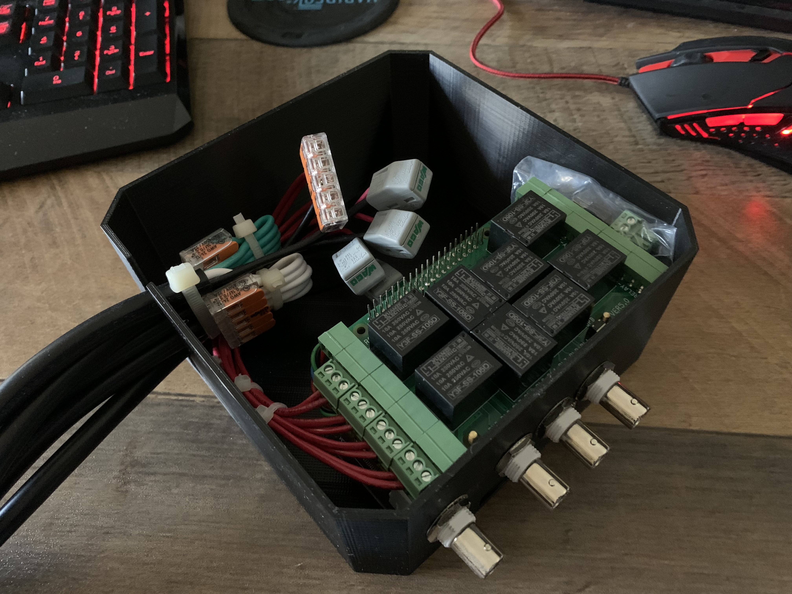
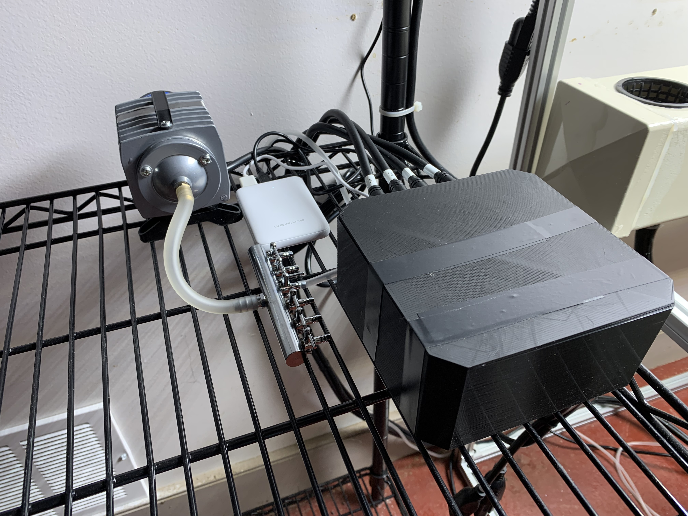
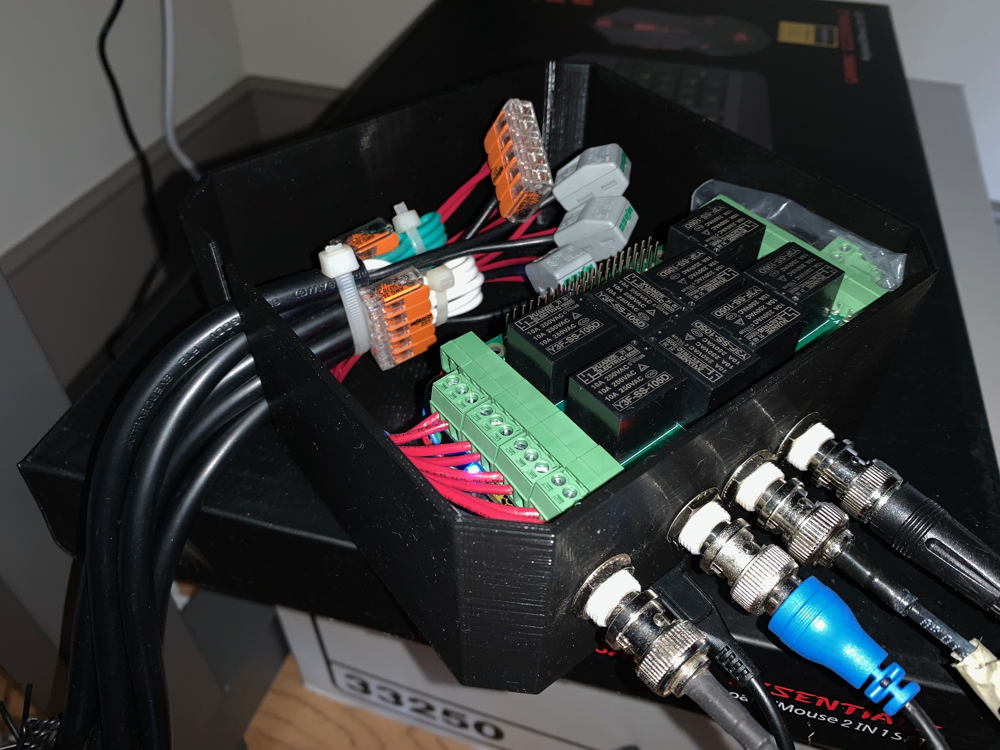
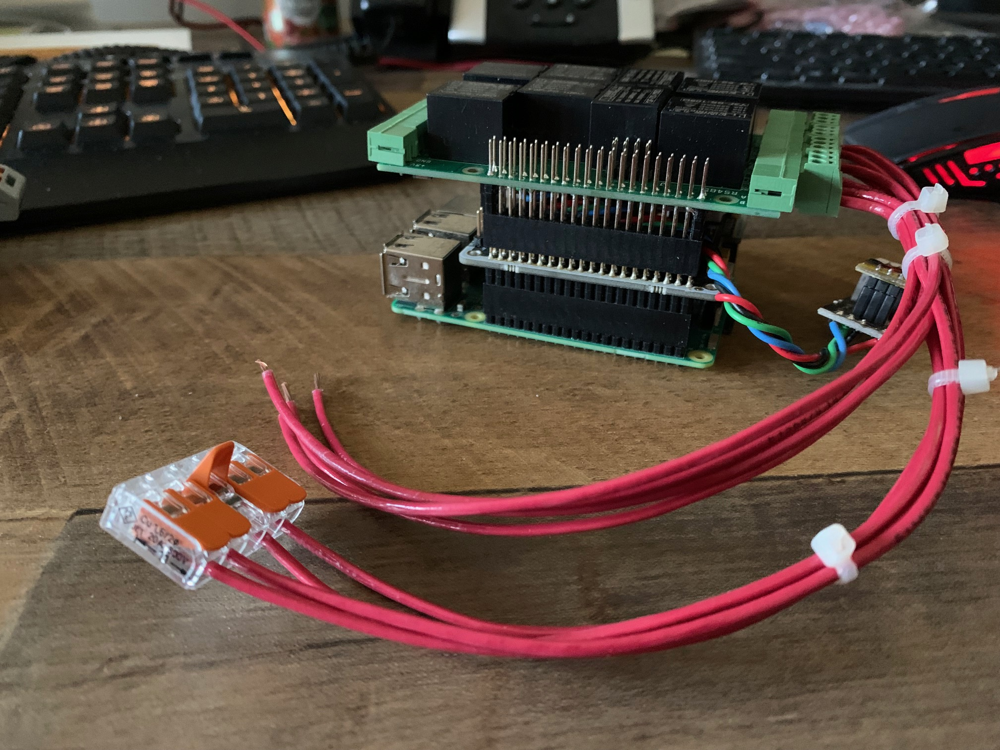
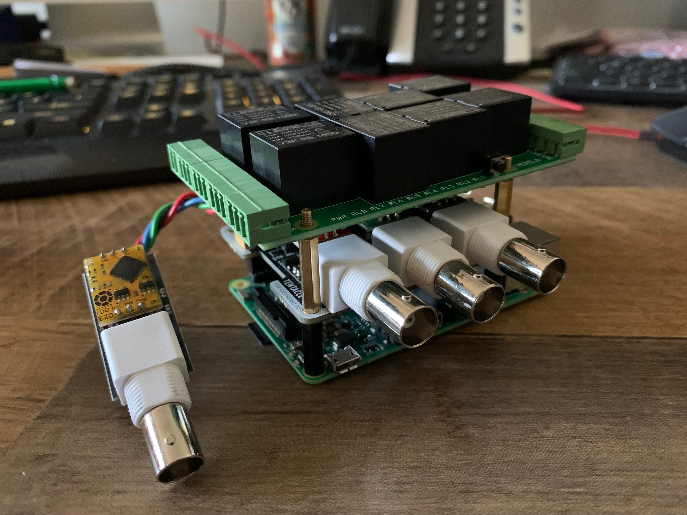
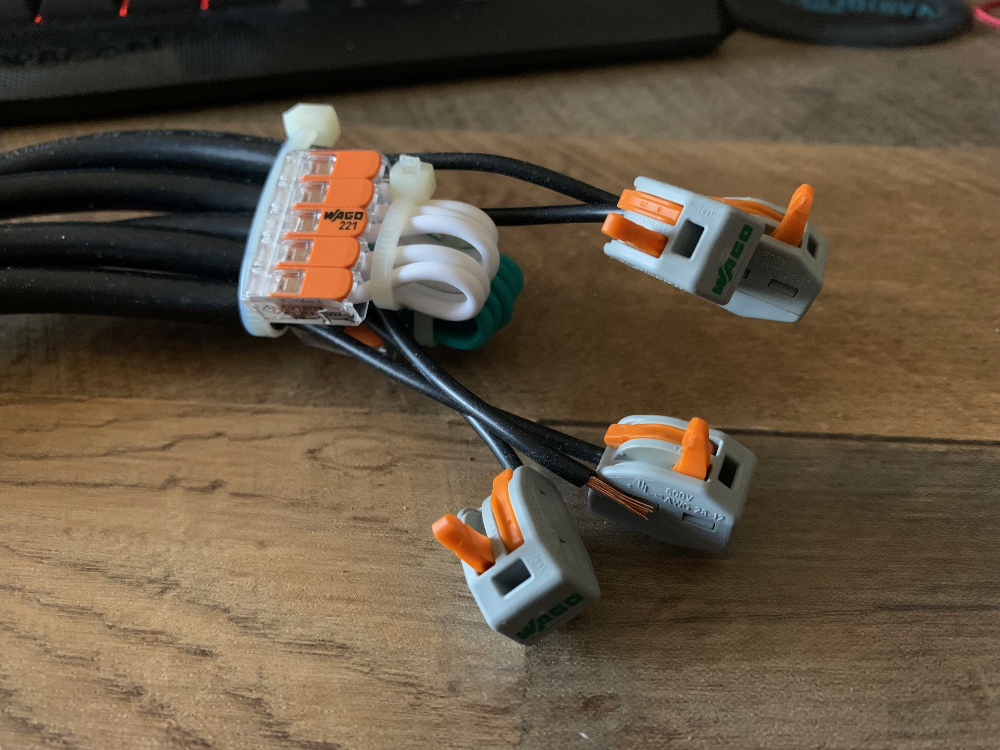

# Mycodo-hyrdoponic-build
A straightforward example of a hardware build to run Mycodo for hydroponics.

## Overview
A few years ago we moved and I finally had the space to start messing around with indoor hydroponics to grow fresh food in winter. At first I used the Kratky method because it was cheap, easy and simple. It worked very well but had it's limitations. As things grew they required more and more tending, sometimes I didn't have the time necessary to take care of them properly. This season I wanted to move on to a more advanced setup that could support fruiting crops such as tomatoes.

Part of my day job is designing and building industrial control and building automation systems. Mechanical timers and checking water quality with handheld devices absolutely works but seemed a little low-tech. What I wanted was something easy to assemble with common tools that I could monitor remotely. This is what I wanted:

- Water Quality
  - Temperature
  - pH
  - EC (electrical conductivity)
- Air Quality
  - Temperature
  - Humidity
  -CO2
- Control
  - 120VAC or 24VDC relays

## Hardware
- Raspberry Pi 3 or 4 (or equivalent)
  - [SanDisk 128GB Ultra microSDXC UHS-I Memory Card (or equivalent)](https://smile.amazon.com/gp/product/B08GYKNCCP/ref=ppx_yo_dt_b_asin_title_o04_s00?ie=UTF8&psc=1)
  - [2.5mm Nylon Standoffs (as needed)](https://smile.amazon.com/Generic-Spacer-Assorted-Raspberry-Pi-Standoff/dp/B014J1ZLD6/ref=sr_1_5?crid=3M7GM3E3F7HYO&keywords=2.5+mm+nylon+standoff&qid=1667400137&qu=eyJxc2MiOiIwLjAwIiwicXNhIjoiMC4wMCIsInFzcCI6IjAuMDAifQ%3D%3D&sprefix=2.5+mm+nylon+standoff%2Caps%2C80&sr=8-5)
  - [GeeekPi 2x20 40 Pin Stacking Female Header Kit (as needed)](https://smile.amazon.com/dp/B08GC18NMK?psc=1&ref=ppx_yo2ov_dt_b_product_details)
- [Atlas/Whitebox Tentacle T3](https://atlas-scientific.com/electrical-isolation/whitebox-t3/)
  - [Atlas EZO™ pH Circuit and probe](https://atlas-scientific.com/embedded-solutions/ezo-ph-circuit)
  - [Atlas EZO™ Conductivity Circuit and probe](https://atlas-scientific.com/embedded-solutions/ezo-conductivity-circuit)
  - [Atlas EZO™ RTD Temperature Circuit and probe](https://atlas-scientific.com/embedded-solutions/ezo-rtd-temperature-circuit)
  - [Atlas EZO™ Dissolved Oxygen Circuit and probe (optional)](https://atlas-scientific.com/embedded-solutions/ezo-dissolved-oxygen-circuit/)
- [SCD41 CO2 Sensor Photoacoustic CO2, Temp & Humidity](http://adafru.it/5190)
  - [STEMMA QT / Qwiic JST SH 4-Pin Cable (modified)](https://www.adafruit.com/product/4399)
    - [Crimping Tool, housings, pins/sockets](https://www.pololu.com/product/1928)
- [Sequent Stackable 8-Channel Relay](https://smile.amazon.com/dp/B07KRKS67G?psc=1&ref=ppx_yo2ov_dt_b_product_details)
  - 120VAC/4A or 24VDC/4A 
  - [Cable Matters 2-Pack 16 AWG Heavy Duty Power Extension Cord 3 ft (modified)](https://smile.amazon.com/gp/product/B0153T1KNS/ref=ppx_yo_dt_b_asin_title_o01_s01?ie=UTF8&psc=1)
    - Wire Stripper/Cutter
  - [Wago 5-Wire Connectors](https://www.adafruit.com/product/874)

## Gallery
|  |   |
| --- | --- |
|  |  |
|  |  |
|  |  |

